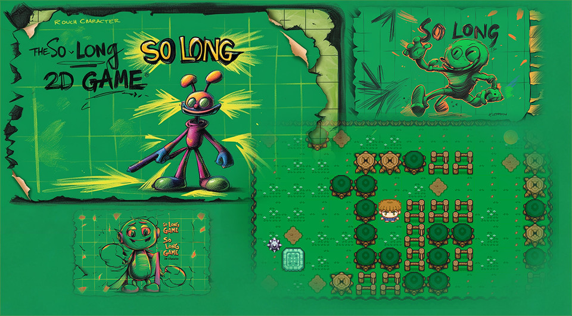

# so_long

<p align="center">
  
</p>

## Parte obligatoria

| Aspecto                 | Detalle                                   |
|-------------------------|-------------------------------------------|
| **Nombre del Programa** | `so_long`                                 |
| **Archivos a Entregar** | Makefile, `*.h`, `*.c`, maps, textures   |
| **Makefile**            | Debe incluir las reglas: `NAME`, `all`, `clean`, `fclean`, `re`, `bonus` |
| **Argumentos**          | Un mapa en formato `*.ber`                |
| **Funciones Permitidas**| `open`, `close`, `read`, `write`, `malloc`, `free`, `perror`, `strerror`, `exit`, todas las funciones de la librería math (flag del compilador -lm), todas las funciones de la miniLibX, `ft_printf` y cualquier función equivalente que tú hayas escrito |
| **Uso de libft**        | Permitido                                 |
| **Descripción**         | Crear un juego 2D donde un delfín escape del planeta Tierra después de comer pescado. |

El proyecto debe cumplir con las siguientes normas:
- Debes usar la miniLibX. Ya sea la versión disponible en el sistema operativo o su fuente. Si eliges trabajar con la fuente, deberás compilar siguiendo las mismas normas que con tu libft, descritas en la parte de Instrucciones generales.
- Debes entregar un Makefile que compile con tus archivos fuente.
- Tu programa debe aceptar como primer argumento un archivo con la descripción del mapa de extensión .ber.

## 1. Juego

- El objetivo del jugador es recolectar todos los objetos presentes en el mapa y salir eligiendo la ruta más corta posible.
- Las teclas W, A, S y D se utilizarán para mover al personaje principal.
- El jugador debe poder moverse en 4 direcciones: subir, bajar, izquierda o derecha.
- El jugador no puede entrar en las paredes.
- Tras cada movimiento, el número real de movimientos debe mostrarse en un terminal.
- Utilizarás una perspectiva 2D (vista de pájaro o lateral).
- El juego no necesita ser en tiempo real.

## 2. Gestión de gráficos

- El programa mostrará la imagen en una ventana.
- La gestión de tu ventana debe ser limpia (cambiar de ventana, minimizar, etc.).
- Pulsar la tecla ESC debe cerrar la ventana y el programa limpiamente.
- Hacer clic en la cruz roja de la ventana debe cerrar la ventana y terminar el programa limpiamente.
- El uso de imágenes de la miniLibX es obligatorio.

## 3. Mapa

- El mapa estará construido de 3 componentes: paredes, objetos y espacio abierto.
- El mapa estará compuesto solo por 5 caracteres: 0 para un espacio vacío, 1 para un muro, C para un coleccionable, E para salir del mapa y P para la posición inicial del jugador.

Ejemplo de un mapa válido:
```sh
1111111111111
10010000000C1
1000011111001
1P0011E000001
1111111111111
```

- El mapa debe tener una salida, al menos un objeto y una posición inicial. Si el mapa contiene caracteres duplicados (salida o posición inicial), se debe mostrar un mensaje de error.
- El mapa debe ser rectangular.
- El mapa deberá estar cerrado/rodeado de muros; en caso contrario, el programa deberá devolver un error.
- Debes comprobar si hay un camino válido en el mapa.
- Debes poder procesar cualquier tipo de mapa, siempre que respete las anteriores normas.

Ejemplo minimalista de un mapa .ber:


```sh
1111111111111111111111111111111111
1E0000000000000C00000C000000000001
1010010100100000101001000000010101
1010010010101010001001000000010101
1P0000000C00C0000000000000000000C1
1111111111111111111111111111111111
```

- En caso de fallos de configuración de cualquier tipo encontrados en el archivo, el programa debe terminar correctamente y devolver “Error\n” seguido de un mensaje explícito de tu elección.

## Bonus

### Parte extra

Se permite el uso de otras funciones para completar la parte extra, siempre que su uso se justifique durante la evaluación. 

Conseguirás puntos extra si:
- Haces que el jugador pierda cuando toque una patrulla de enemigos.
- Añades animaciones de sprites.
- Muestras el contador de movimiento directamente en la pantalla en lugar de en el terminal.

Puedes añadir tantos archivos o carpetas como necesites para tus bonus.

